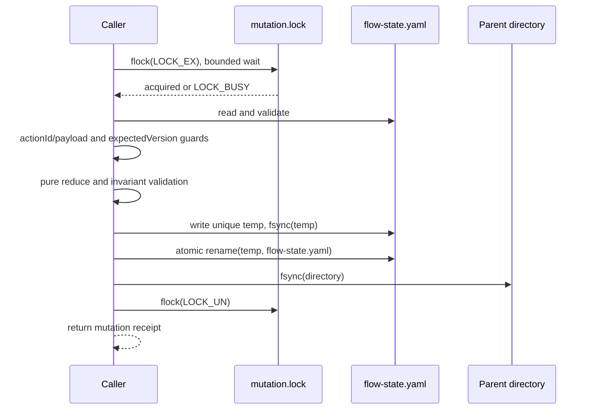
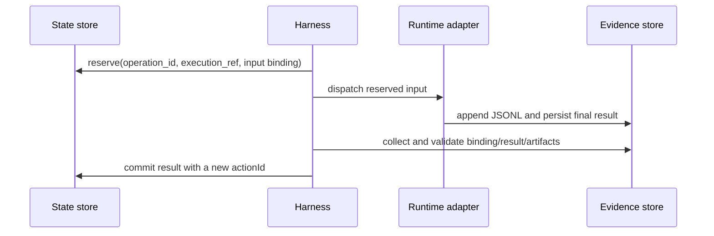

# CAS Commit Protocol v1

The M1 store implements the exported `StateMutationStore` draft:

```ts
mutate(changeId, { expectedVersion, actionId, action, payload }): Promise<MutationReceipt>
```

Every state writer takes the same short-lived exclusive advisory lock on a fixed `mutation.lock`
inode. The lock covers read, parse, validation, reduction, and durable replacement. No Agent,
machine check, or network call runs while this lock is held. A separate fixed-inode `executor.lock`
serializes dispatch for one change.



If `actionId` is already in history with the same canonical payload digest, `mutate` returns the
original receipt with `replayed: true`. The same ID with a different digest returns
`ACTION_CONFLICT`. A version mismatch returns `VERSION_CONFLICT`. Reducer guards run only after
these checks and return `INVALID_ACTION` without writing.

The implementation writes a uniquely named temp file in the state file's directory, syncs it,
renames it atomically, then syncs the directory. A crash before rename exposes the old complete
state. A crash after rename exposes the new complete state. A directory sync failure has an unknown
commit outcome; the caller re-reads history by `actionId` before doing anything else. Temp files are
never recovery candidates.

## External operation window



After reserve, dispatch may have produced workspace side effects. A lost or unknown operation enters
`reconciling`; the controller inspects the process and persisted result and never starts a second
write execution automatically. A collected result can still be committed after a concurrent pause
when its operation binding remains current; pause prevents the next dispatch.

## Error codes

| Code | Contract |
|---|---|
| `LOCK_BUSY` | Timed out acquiring the mutation or executor lock; no state change. |
| `VERSION_CONFLICT` | `expectedVersion` is stale; caller re-reads state. |
| `ACTION_CONFLICT` | Existing `actionId` has a different payload digest. |
| `INVALID_ACTION` | Reducer guard rejected the event; no state change. |
| `INVALID_STATE` / `UNSUPPORTED_SCHEMA` | Stored control state cannot be used; preserve it for diagnosis. |
| `INVALID_WORKFLOW_PROFILE` | Project Profile failed its external-boundary schema. |
| `INVALID_EXECUTION_RESULT` / `INVALID_EVENT` | External record failed structural or semantic validation. |
| `PLANNED_SKILL_MISSING` / `RESOURCE_DRIFT` | Block until the frozen Skill input can be restored or Workflow is switched. |
| `SPEC_DRIFT` | Return to Shape and obtain a new human approval. |
| `CANDIDATE_DRIFT` / `STALE_RESULT` | Reject evidence that does not bind to the current candidate. |
| `EXECUTION_UNKNOWN` | Reconcile persisted process/result evidence; do not redispatch. |
| `EXECUTION_FAILED` | Retry only after old process termination is known and budget permits. |
| `ARTIFACT_MISSING` / `FINALIZE_FAILED` | Block without marking the change completed. |

The repeatable Linux spike is `pnpm spike:cas`. Its checked-in result at
`docs/evidence/m0/cas-filesystem.json` verifies fixed inode locking, contention, process-exit lock
release, and durable atomic replacement on the recorded environment. D01-D04 remain M1
implementation tests; their M0 design vectors are frozen in `fixtures/cas/d01-d04.yaml`.
