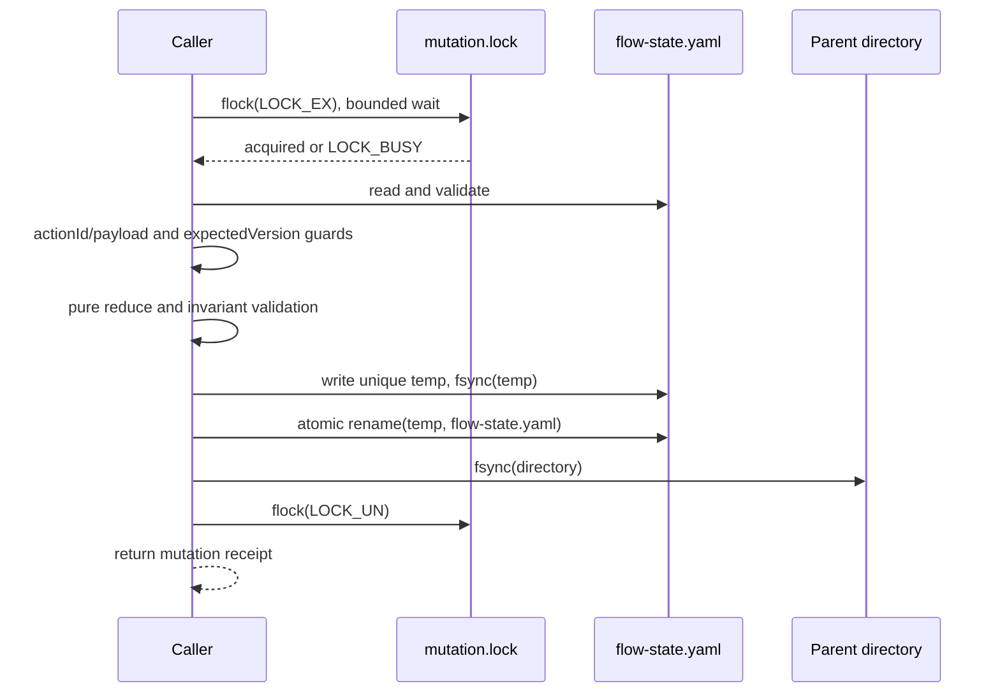
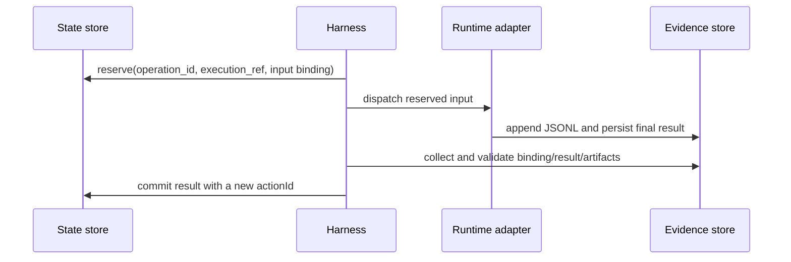

# CAS 提交协议 v1

CAS（比较并交换）协议定义状态文件的并发提交边界。方法名、错误码、路径和时序图中的机器标识保持英文；正文说明使用简体中文。

> 中文说明：CAS（比较并交换）提交协议用于并发安全地写入状态。方法名、错误码和 Mermaid 标识保持英文，正文面向简体中文贡献者。

M1 的存储实现导出的 `StateMutationStore` 草案接口：

```ts
mutate(changeId, { expectedVersion, expectedStateDigest?, actionId, action, payload }): Promise<MutationReceipt>
```

每个状态写入方都必须在固定的 `mutation.lock` inode 上获取同一个短时独占 advisory lock。锁的保护范围包括读取、解析、校验、reducer 处理和持久化替换。持锁期间不得运行 Agent、机器检查或网络调用。另一个固定 inode 的 `executor.lock` 用于串行化同一 change 的派发。



如果历史记录中已有相同 `actionId` 且规范化 payload 摘要相同，`mutate` 返回原始回执并标记 `replayed: true`。相同 ID 但摘要不同则返回 `ACTION_CONFLICT`。版本不匹配返回 `VERSION_CONFLICT`。Stage Runner 还必须提交调用前的 `expectedStateDigest`；即使外部进程改写状态后保留原版本号，摘要不匹配仍返回 `VERSION_CONFLICT`。只有通过这些检查后才运行 reducer 守卫；守卫失败返回 `INVALID_ACTION`，且不写入状态。

实现会在状态文件所在目录写入唯一命名的临时文件并同步，然后原子重命名，最后同步目录。重命名前崩溃时仍能看到旧的完整状态；重命名后崩溃时能看到新的完整状态。目录同步失败时提交结果未知，调用方必须先按 `actionId` 重新读取历史，再执行其他操作。临时文件永远不能作为恢复候选。

## 外部操作窗口



reserve 之后，dispatch 可能已经对工作区产生副作用。丢失或未知的操作进入 `reconciling`；控制器检查进程和已持久化结果，不会自动再次启动可能写入代码的执行。并发 pause 后，只要操作绑定仍然有效，已收取的结果仍可提交；pause 只阻止后续派发。

## 错误码

| 错误码 | 说明 |
|---|---|
| `LOCK_BUSY` | 获取 mutation 或 executor lock 超时；状态不变。 |
| `VERSION_CONFLICT` | `expectedVersion` 已过期；调用方重新读取状态。 |
| `ACTION_CONFLICT` | 已存在的 `actionId` 对应不同 payload 摘要。 |
| `INVALID_ACTION` | reducer 守卫拒绝该事件；状态不变。 |
| `INVALID_STATE` / `UNSUPPORTED_SCHEMA` | 保存的控制状态不可用；保留原文件以便诊断。 |
| `INVALID_WORKFLOW_PROFILE` | 项目 Profile 未通过外部边界 Schema 校验。 |
| `INVALID_EXECUTION_RESULT` / `INVALID_EVENT` | 外部记录未通过结构或语义校验。 |
| `PLANNED_SKILL_MISSING` / `RESOURCE_DRIFT` | 阻塞，直到冻结的 Skill 输入恢复或切换 Workflow。 |
| `SPEC_DRIFT` | 返回 Shape 并获取新的人工批准。 |
| `CANDIDATE_DRIFT` / `STALE_RESULT` | 拒绝未绑定当前候选的证据。 |
| `EXECUTION_UNKNOWN` | 核对已持久化的进程和结果证据；不要重新派发。 |
| `EXECUTION_FAILED` | 只有确认旧进程已终止且预算允许时才能重试。 |
| `ARTIFACT_MISSING` / `FINALIZE_FAILED` | 保持阻塞，不得将 change 标记为 completed。 |

可重复运行的 Linux spike 命令是 `pnpm spike:cas`。其签入仓库的结果 `docs/evidence/m0/cas-filesystem.json` 会在记录的环境中验证固定 inode 锁、锁竞争、进程退出后的锁释放以及持久化原子替换。D01-D04 仍属于 M1 实现测试；对应的 M0 设计向量冻结在 `fixtures/cas/d01-d04.yaml`。
